# MyTimeTree 主屏植物 & 挂件视觉方案（选型稿）

> 供明早快速选型。渲染图均在 `docs/design-renders/`。  
> 现状：主屏树仅为 CSS 圆形色块，挂件是纯文字计数；本次目标是让小朋友「一眼爱上这棵树」。

---

## 1. 设计目标

| 目标 | 说明 |
|------|------|
| 讨喜 | 圆润、温暖、可读；不吓人（虫也要可爱） |
| 阶段可辨 | 10 个生长阶段外形递进清晰，小屏也能区分 |
| 挂件可识别 | 星 / 太阳 / 果 / 虫 / 鸟 形状差异大，不靠颜色盲辨 |
| 可落地 | 优先能做成 SVG / Lottie / 静帧精灵图，避免过重 3D 实时渲染 |
| 品牌一致 | 延续现有薄荷绿 + 暖阳色，避开常见 AI 紫炫光风 |

**生长阶段（与代码一致）**

| 阶段 key | 中文 | 净资产区间（分） |
|----------|------|------------------|
| seed | 种子 | [0, 20) |
| sprout | 胚芽 | [20, 50) |
| break_soil | 破土 | [50, 100) |
| germinate | 发芽 | [100, 150) |
| sapling | 树苗 | [150, 200) |
| young | 小树 | [200, 250) |
| tall | 高树 | [250, 300) |
| big | 大树 | [300, 400) |
| giant | 巨树 | [400, 500) |
| fruiting | 结果 | ≥ 500 |

**挂件语义**

| 显示名 | 含义 | 视觉角色 |
|--------|------|----------|
| 星 | 手动存入奖励 | 点缀光点，可挂枝头 |
| 太阳 | 100 星转化 | 树冠旁「大成就」 |
| 果 | 实时月均达标（计算值） | 挂在枝上的果实 |
| 虫 | 借用 | 叶子上的可爱毛毛虫 |
| 鸟 | 负债还清 | 啄木鸟停在树干 |

---

## 2. 三套风格总览（请先选一套主风格）

### 方案 A · 绘本草地 Storybook Meadow（推荐首选）

- **气质**：水彩绘本、柔和日照、故事感强  
- **优点**：最有「陪伴感」；家长/孩子都容易共情；与现有浅绿 UI 很搭  
- **代价**：细节多，需收敛成可缩放 SVG；动画宜用轻量位移动效  
- **适合**：强调情感与长期养成

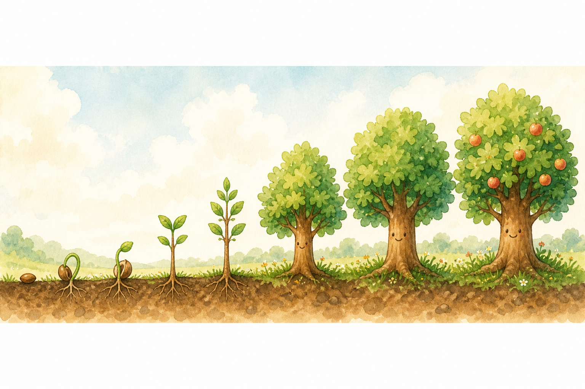

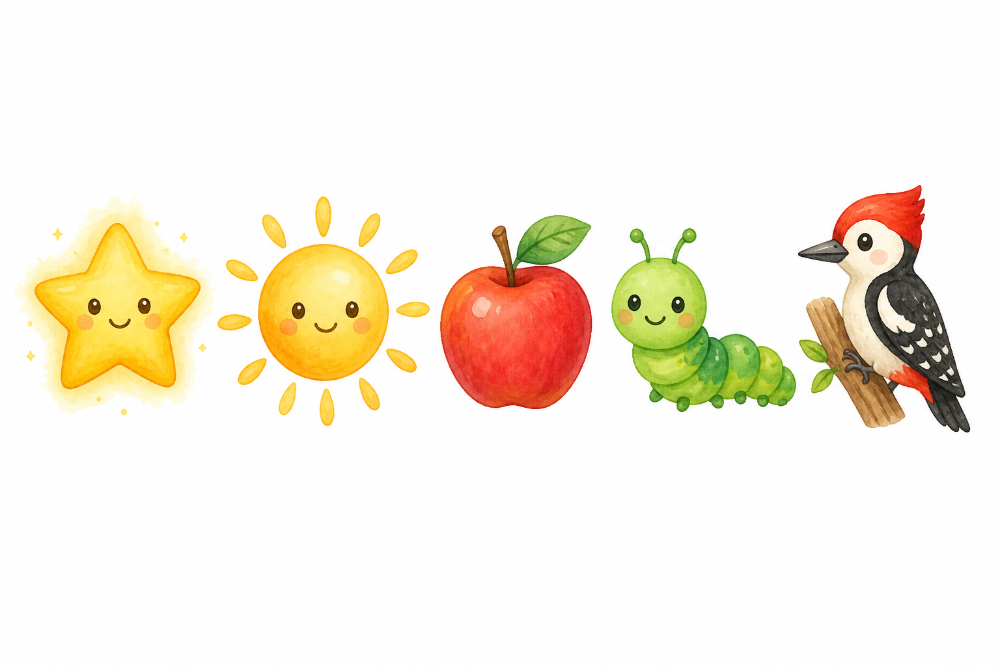

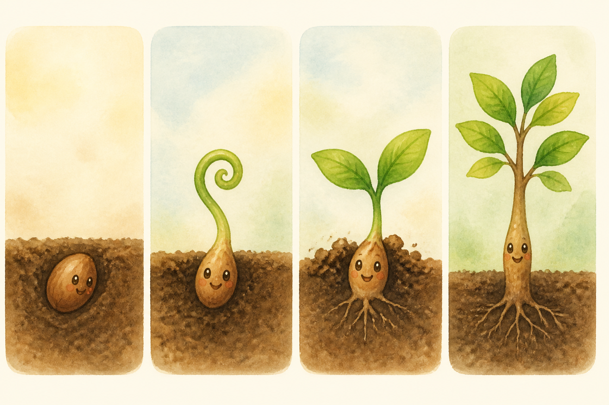

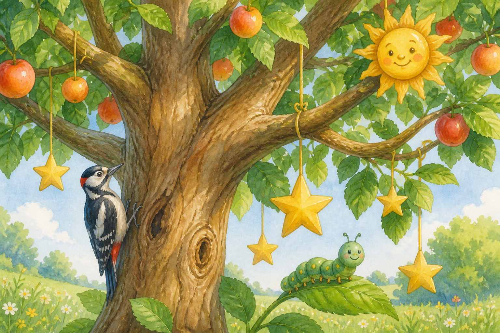

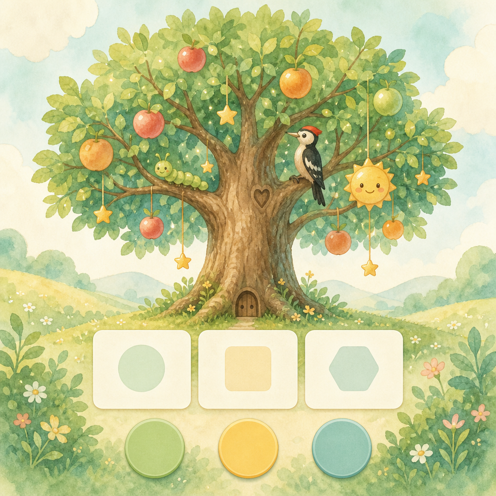

---

### 方案 B · 粘土玩具 Clay Toy Garden

- **气质**：软泥/定格动画玩具质感，手作感  
- **优点**：触觉感强、萌点足、拍照级质感  
- **代价**：真 3D 成本高；建议烘焙成静帧或伪 3D 插画；包体更大  
- **适合**：想要「玩具感 / 收藏感」

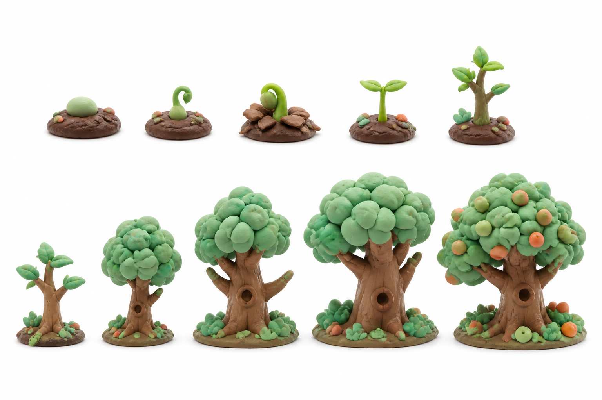

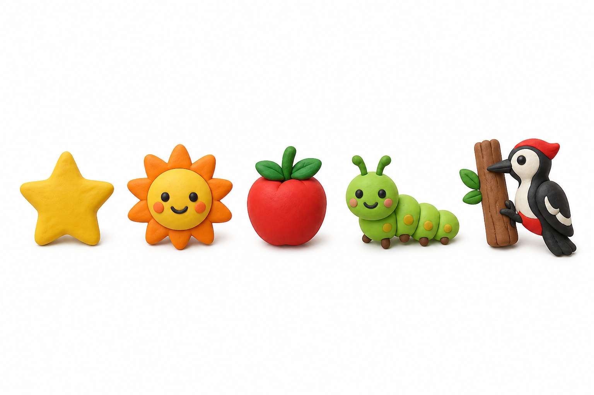

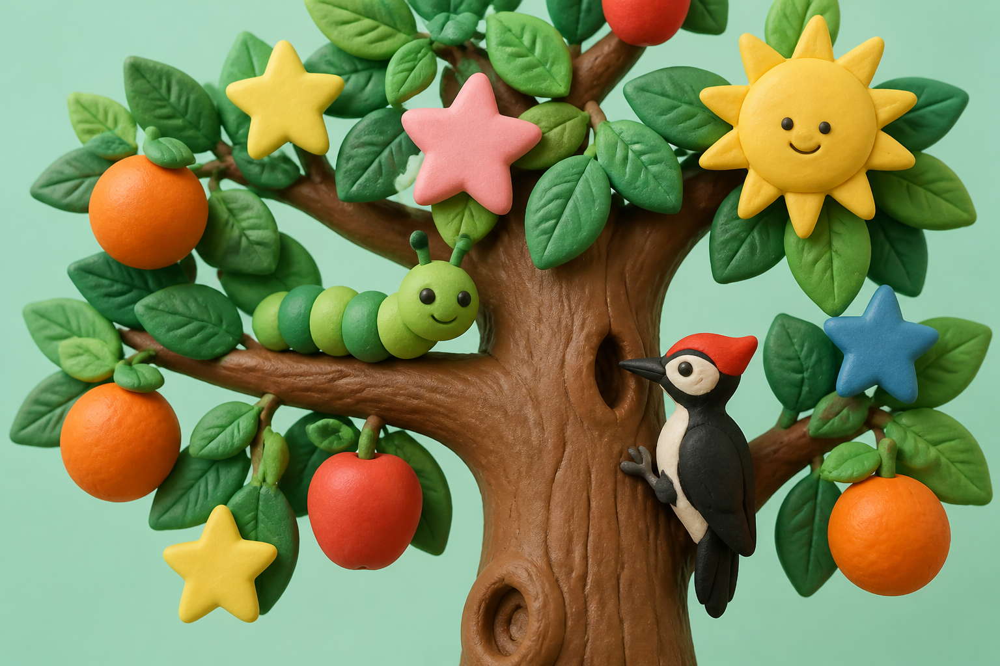

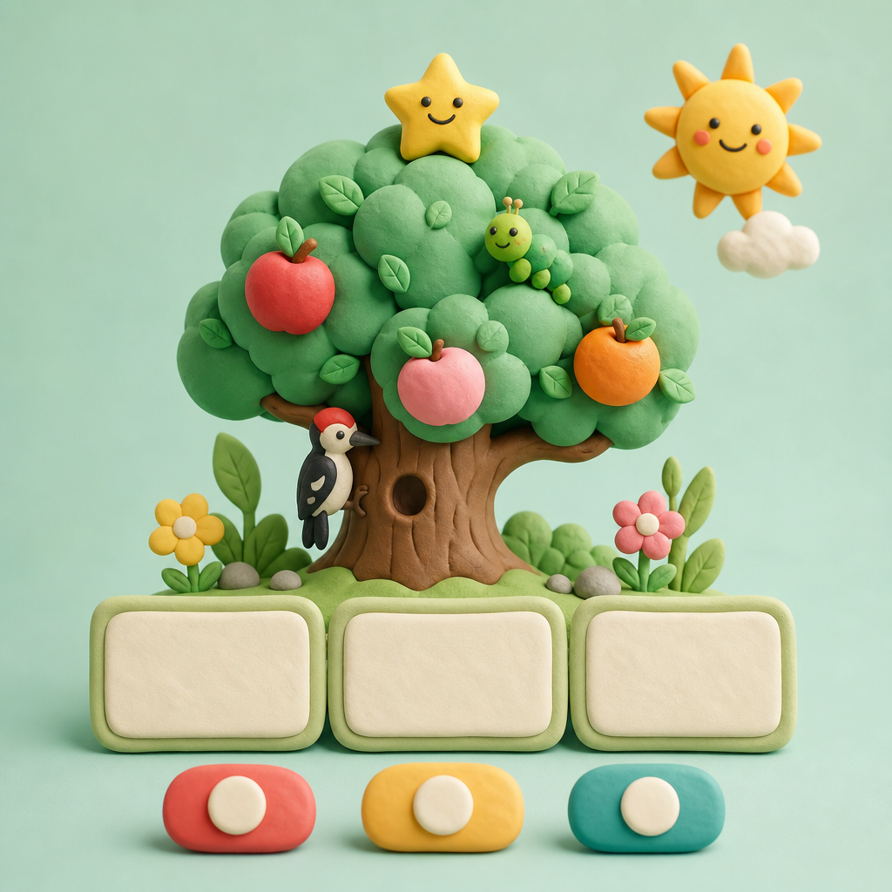

---

### 方案 C · 贴纸矢量 Sticker Pop（推荐工程首选）

- **气质**：粗描边、扁平贴纸、小屏超清晰  
- **优点**：最好落地（SVG sprite）；动画轻；无障碍对比度好  
- **代价**：故事氛围弱于 A；要靠动效与微表情补温暖感  
- **适合**：快速上线、多端一致、性能优先

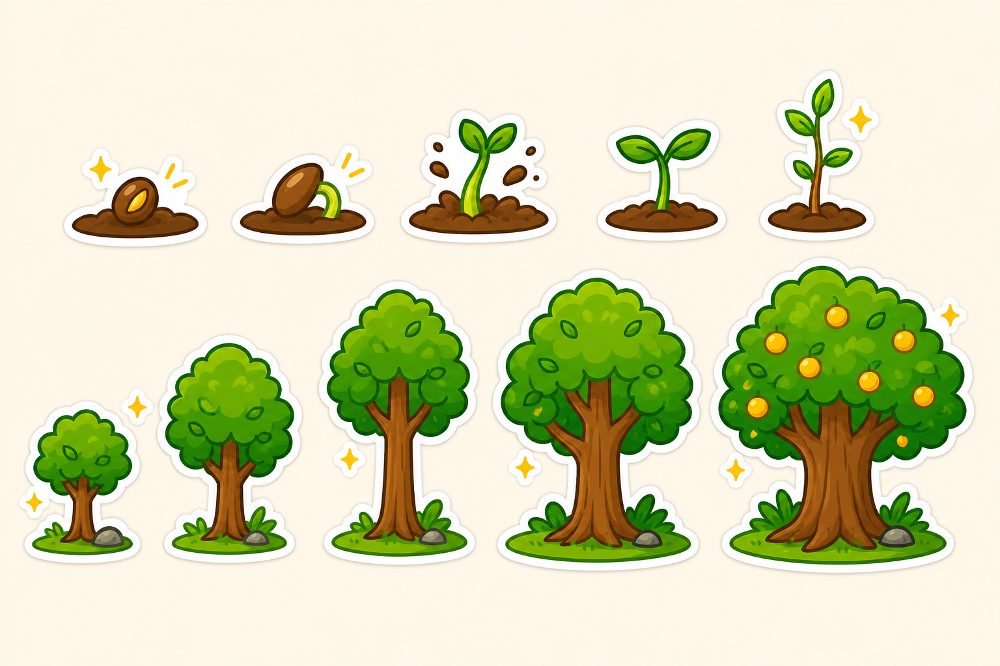

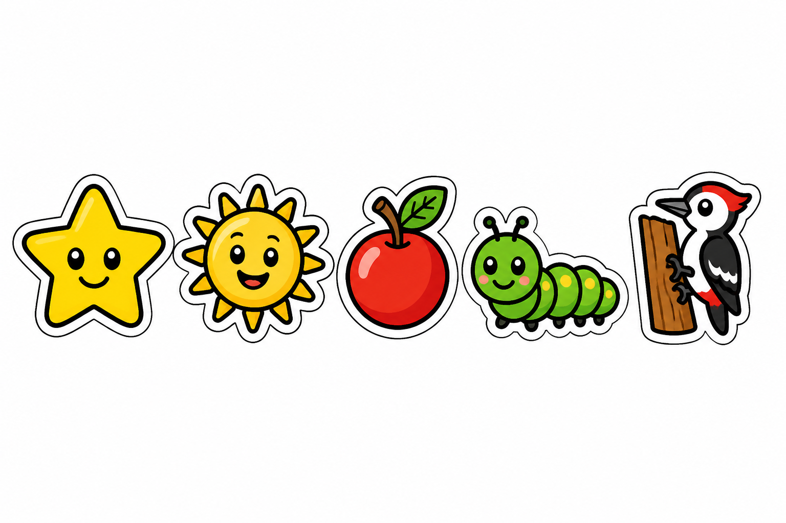

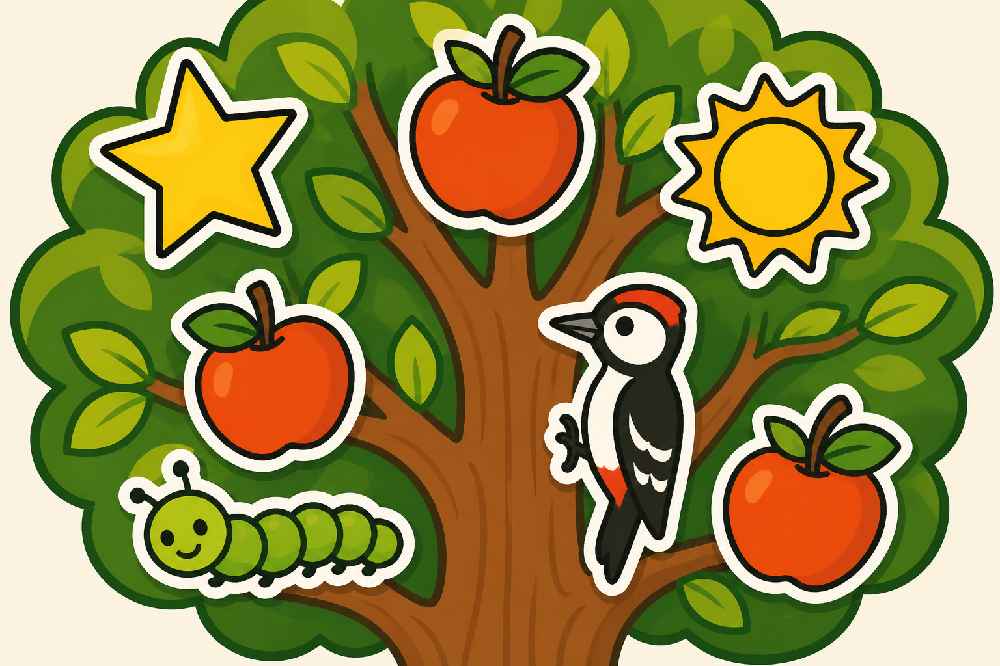

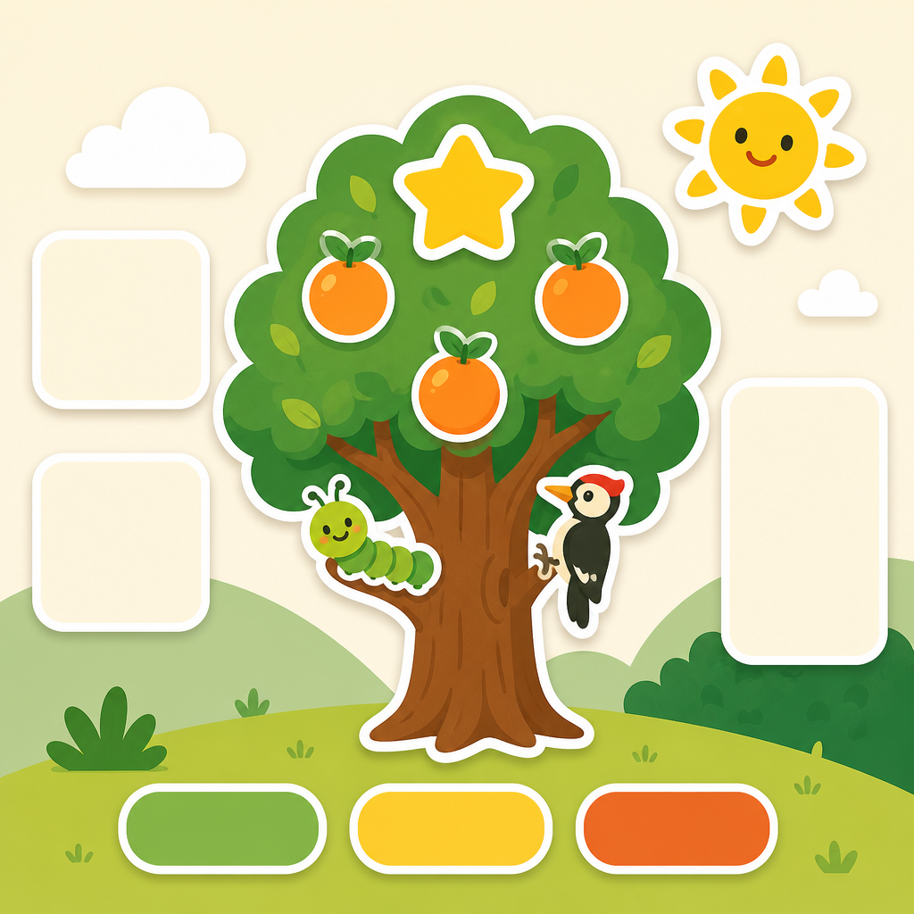

---

## 3. 选型建议（可直接勾选）

### 3.1 主风格（三选一）

- [ ] **A 绘本草地** — 最讨喜、情感强（设计向推荐）
- [ ] **B 粘土玩具** — 最萌、质感强（若接受插画伪 3D）
- [ ] **C 贴纸矢量** — 最好实现、最清晰（工程向推荐）

**折中建议**：选 **A 的造型语言 + C 的描边清晰度**（即「清晰描边的绘本风」），既讨喜又易做成 SVG。

### 3.2 主屏树呈现方式（可多选倾向）

- [ ] 全阶段独立插画静帧（10 张切换）
- [ ] 1 棵「可变树」部件组合（树干/树冠/叶子层级换装）— 包体更小
- [ ] 结果阶段才显示挂件精灵；早期只显示植物本体

### 3.3 挂件呈现方式

- [ ] 挂在树上的精灵（推荐，沉浸）
- [ ] 树下图标条 + 数字（现状加强版，信息更清楚）
- [ ] 两者结合：树上少量代表物 + 下方完整计数（推荐落地）

### 3.4 动效强度

- [ ] 轻：呼吸、轻晃、挂件轻微浮动（推荐）
- [ ] 中：阶段升级短庆祝动画
- [ ] 重：粒子/变换特效（不建议首版）

---

## 4. 实施路径（选定风格后）

1. **冻结造型**：按选定风格出 10 阶段 + 5 挂件的 SVG 规范稿（统一描边/色板）  
2. **主屏改造**：`tree-visual` 改为 `` / inline SVG / Lottie；`data-stage` 切换资源  
3. **挂件层**：树上 0–N 个代表精灵（上限裁剪，避免堆满）+ 保留文字计数  
4. **无障碍**：色弱友好；虫不用恶心纹理；鸟/虫对比清晰  
5. **性能**：优先 SVG；单阶段 PNG ≤ 80KB；预加载相邻阶段  

---

## 5. 请你明早回复的最小信息

只要回复类似这样即可开工实现：

```text
主风格：A / B / C / A+C 混合
挂件：树上精灵 + 下方计数
动效：轻
优先阶段：先做 seed→sapling + fruiting，其余后补
```

---

## 实施状态（2026-08-07）

已按选型落地 **A+C 混合**（软色填充 + 清晰描边 SVG）：

- 主屏树：10 阶段 SVG（优先精修 seed→sapling + fruiting；young/tall/big/giant 为过渡稿）
- 挂件：树上精灵（数量封顶展示）+ **下方 5 格计数**（星 / 太阳 / 果 / 虫 / 鸟）
- 动效：树轻呼吸 + 挂件轻浮动

资源目录：`src/mytimetree/static/portal/tree/`、`.../ornaments/`


```
docs/tree-visual-design-options.md          ← 本说明
docs/design-renders/
  style-a-storybook-stages.png
  style-a-storybook-ornaments.png
  style-a-early-stages.png
  style-a-fruiting-ornaments-on-tree.png
  style-b-clay-stages.png
  style-b-clay-ornaments.png
  style-b-fruiting-ornaments-on-tree.png
  style-c-sticker-stages.png
  style-c-sticker-ornaments.png
  style-c-fruiting-ornaments-on-tree.png
  mock-home-storybook.png
  mock-home-clay.png
  mock-home-sticker.png
```

（Cursor 资源目录另有同名原图备份：`.cursor/projects/.../assets/`）
